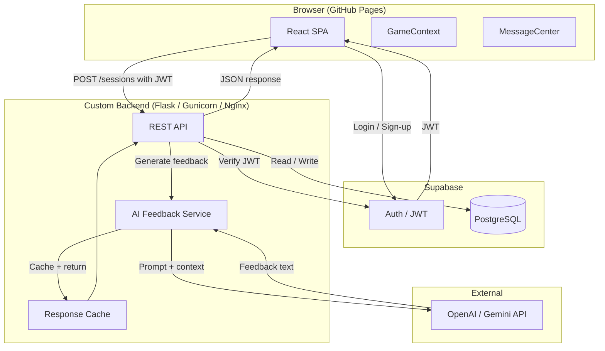
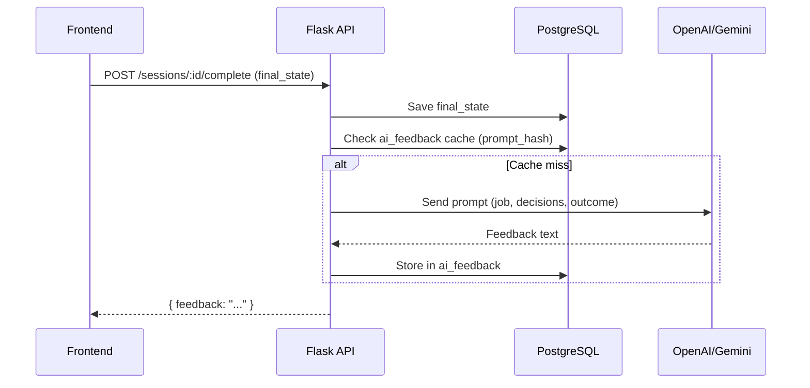
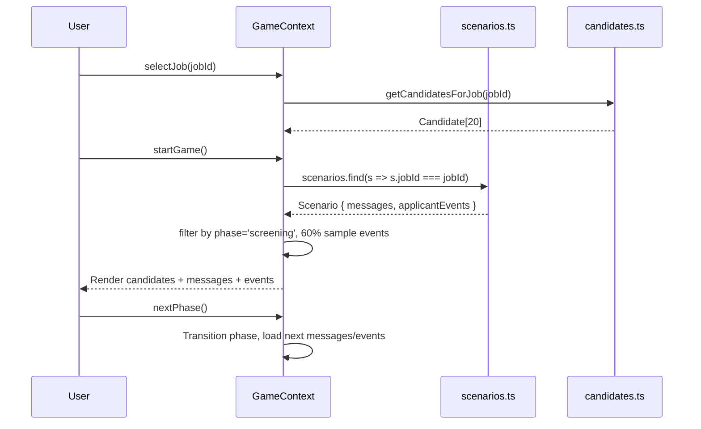

# System Architecture

## Overview

Hiring Manager Simulator uses a **hybrid architecture**: a React/Vite SPA hosted on GitHub Pages for the frontend, with a planned Python/Flask backend for auth, persistence, and AI features.



## Frontend

| Aspect | Detail |
|---|---|
| Framework | React 18 + TypeScript + Vite |
| State | React Context (`GameContext`) — no external store |
| Styling | Tailwind CSS |
| Hosting | GitHub Pages (`/hiringmanager/` base path) |
| Data | All game data is static TypeScript modules (`candidates.ts`, `scenarios.ts`, `jobs.ts`) |

### Key Modules

- **`GameContext.tsx`** — central state machine; manages phase transitions, candidate selection, message/event triggering
- **`scenarios.ts`** — 6 per-job `Scenario` objects with internal messages + applicant events
- **`candidates.ts`** — 20 candidates per job (120 total), diverse archetypes
- **`MessageCenter.tsx`** — renders internal messages (gold border) and applicant events (blue border) as dismissable toast cards

## Backend (Planned)

### Tech Stack

| Layer | Technology |
|---|---|
| Language | Python 3.11+ |
| Framework | Flask |
| WSGI | Gunicorn |
| Reverse Proxy | Nginx |
| Auth | Supabase Auth (JWT) |
| Database | PostgreSQL (via Supabase) |
| AI | OpenAI GPT-4o or Google Gemini |

### API Endpoints

| Method | Path | Description |
|---|---|---|
| `POST` | `/api/sessions` | Create a new game session |
| `PATCH` | `/api/sessions/:id` | Update session state (phase, decisions) |
| `POST` | `/api/sessions/:id/complete` | Mark session complete, trigger AI feedback |
| `GET` | `/api/sessions/:id/feedback` | Return cached or generated AI feedback |
| `GET` | `/api/sessions` | List user's past sessions |

All endpoints require a valid Supabase JWT in the `Authorization: Bearer <token>` header.

### AI Feedback Flow



### AI Prompt Design

The feedback prompt will include:
- The job role (`job_id` → job title)
- Which candidates were screened / interviewed / hired
- The final budget remaining and urgency level
- The actual outcome of the hired candidate (`outcome.type`, `outcome.description`)

Example skeleton:
```
You are a senior HR consultant reviewing a hiring simulation.
Job: {job_title}
Shortlisted: {screened_candidates}
Interviewed: {interviewed_candidates}
Hired: {hired_candidate_name} (outcome: {outcome_type})
Budget remaining: €{budget}

Provide 3-4 sentences of constructive feedback on the hiring decision.
Highlight what was good and what could be improved.
```

## Data Flow (Current — Frontend-Only)



## Deployment

### Current (Frontend-only)
- GitHub Actions workflow auto-deploys on push to `master`
- Builds with `npm run build`, publishes `dist/` to `gh-pages` branch
- Live at: `https://wiesorium.github.io/hiringmanager/`

### Planned (with Backend)
- Flask app deployed on existing VPS (Nginx + Gunicorn)
- CORS configured to allow `wiesorium.github.io`
- Supabase project for Auth + PostgreSQL
- Environment variables: `SUPABASE_URL`, `SUPABASE_KEY`, `OPENAI_API_KEY`
