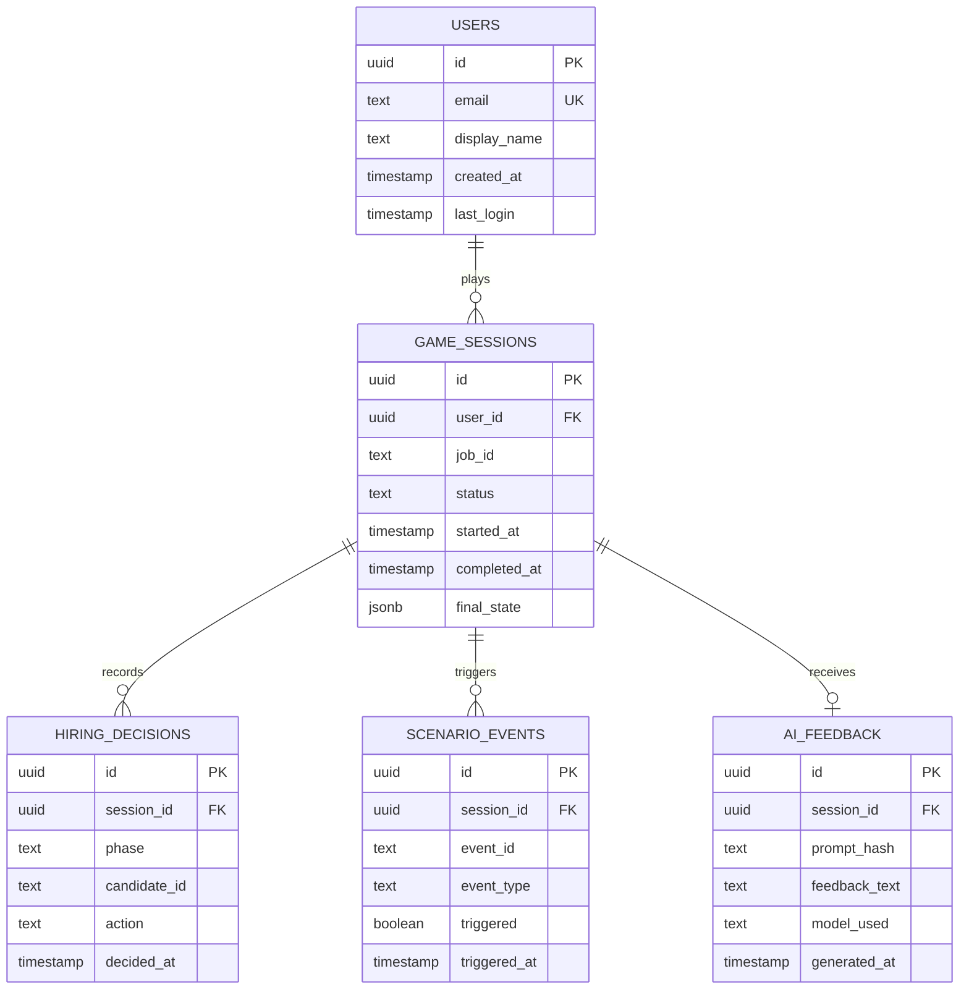

# Database Schema

PostgreSQL schema for the Hiring Manager Simulator backend.

## ER Diagram



## Table Descriptions

### `users`
Managed primarily by **Supabase Auth** — this table mirrors the `auth.users` table for application-level queries.

| Column | Type | Notes |
|---|---|---|
| `id` | `uuid` | Supabase Auth UID |
| `email` | `text` | Unique, from Auth |
| `display_name` | `text` | Optional display name |
| `created_at` | `timestamptz` | Auto-set |
| `last_login` | `timestamptz` | Updated on JWT refresh |

### `game_sessions`
One row per complete game run (job selected → reveal phase).

| Column | Type | Notes |
|---|---|---|
| `id` | `uuid` | PK, auto-generated |
| `user_id` | `uuid` | FK → `users.id` |
| `job_id` | `text` | e.g. `office_assistant` |
| `status` | `text` | `in_progress`, `completed`, `abandoned` |
| `started_at` | `timestamptz` | When the game started |
| `completed_at` | `timestamptz` | Nullable until reveal phase |
| `final_state` | `jsonb` | Snapshot of GameState at reveal (budget, urgency, hired candidate ID) |

### `hiring_decisions`
Granular log of every candidate selection/rejection action.

| Column | Type | Notes |
|---|---|---|
| `id` | `uuid` | PK |
| `session_id` | `uuid` | FK → `game_sessions.id` |
| `phase` | `text` | `screening`, `interviews`, `decision` |
| `candidate_id` | `text` | e.g. `oa3` |
| `action` | `text` | `selected`, `rejected`, `hired` |
| `decided_at` | `timestamptz` | Auto-set |

### `scenario_events`
Tracks which randomized events (applicant emails, withdrawals) were triggered per session.

| Column | Type | Notes |
|---|---|---|
| `id` | `uuid` | PK |
| `session_id` | `uuid` | FK → `game_sessions.id` |
| `event_id` | `text` | e.g. `oa_ae1` |
| `event_type` | `text` | `thank_you_mail`, `withdrawal`, etc. |
| `triggered` | `bool` | Whether random 60% check passed |
| `triggered_at` | `timestamptz` | Phase transition timestamp |

### `ai_feedback`
Caches AI-generated post-game feedback to avoid redundant API calls.

| Column | Type | Notes |
|---|---|---|
| `id` | `uuid` | PK |
| `session_id` | `uuid` | FK → `game_sessions.id`, UNIQUE |
| `prompt_hash` | `text` | MD5 of the prompt (for cache lookup) |
| `feedback_text` | `text` | Full AI response |
| `model_used` | `text` | e.g. `gpt-4o`, `gemini-1.5-flash` |
| `generated_at` | `timestamptz` | Auto-set |

## Indexes

```sql
CREATE INDEX idx_game_sessions_user ON game_sessions(user_id);
CREATE INDEX idx_hiring_decisions_session ON hiring_decisions(session_id);
CREATE INDEX idx_ai_feedback_hash ON ai_feedback(prompt_hash);
```

## Row-Level Security (Supabase)

```sql
-- Users can only see their own sessions
ALTER TABLE game_sessions ENABLE ROW LEVEL SECURITY;
CREATE POLICY "own sessions" ON game_sessions
  FOR ALL USING (auth.uid() = user_id);

-- Decisions visible only through session ownership
ALTER TABLE hiring_decisions ENABLE ROW LEVEL SECURITY;
CREATE POLICY "own decisions" ON hiring_decisions
  FOR ALL USING (
    session_id IN (SELECT id FROM game_sessions WHERE user_id = auth.uid())
  );
```
